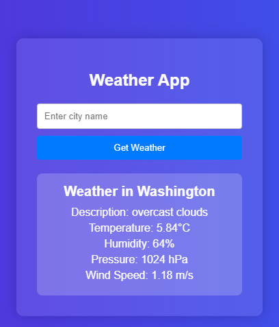

# Weather App

This is a simple Django-based web application that fetches and displays weather information for a specified city using the OpenWeatherMap API.

## Table of Contents

- [Installation](#installation)
- [Configuration](#configuration)
- [Usage](#usage)
- [Project Structure](#project-structure)
- [API Key](#api-key)
- [Running the Application](#running-the-application)
- [Screenshots](#screenshots)
- [License](#license)

## Installation

1. **Clone the repository:**

    ```sh
    git clone https://github.com/h87g254/Weather-Application.git
    cd weather_app
    ```

2. **Create a virtual environment:**

    ```sh
    python -m venv weather_venv
    ```

3. **Activate the virtual environment:**

    - On Windows:
        ```sh
        weather_venv\Scripts\activate
        ```
    - On macOS/Linux:
        ```sh
        source weather_venv/bin/activate
        ```

4. **Install the required packages:**

    ```sh
    pip install -r requirements.txt
    ```

## Configuration

1. **API Key:**
    - Obtain an API key from [OpenWeatherMap](https://openweathermap.org).
    - Replace `'YOUR_API_KEY'` in [views.py](weather_project/weather_app/views.py) with your actual API key.
      
## Usage

1. **Run the Django development server:**

    ```sh
    python weather_project/manage.py runserver
    ```

2. **Open your web browser and navigate to:**

    ```
    http://127.0.0.1:8000/
    ```

3. **Enter a city name in the input field and submit to get the weather information.**

## API Key

To use the OpenWeatherMap API, you need an API key. Follow these steps to get one:

1. Go to [OpenWeatherMap](https://openweathermap.org/api) and sign up for an account.
2. Navigate to the API keys section in your account.
3. Generate a new API key.
4. Replace `'YOUR_API_KEY'` in [`weather_project/weather_app/views.py`](weather_project/weather_app/views.py) with your actual API key.

## Running the Application

1. **Start the Django development server:**

    ```sh
    python weather_project/manage.py runserver
    ```

2. **Open your web browser and navigate to:**

    ```
    http://127.0.0.1:8000/
    ```

3. **Enter a city name in the input field and submit to get the weather information.**

## Screenshots


